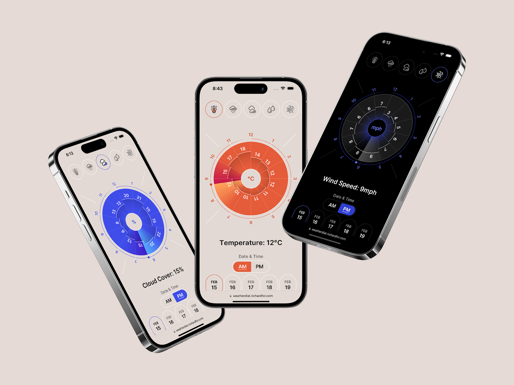

## What is Weather Dial?

Weather Dial is a [SvelteKit](https://kit.svelte.dev/) weather web application that displays information in a circular barplot. It is currently a demo that does not fetch real data from any API.

View the [production website](https://weatherdial.richardfxr.com/) or [learn more about the project’s design](https://www.richardfxr.com/projects/weatherdial).
 

## Technical Overview

Weahter Dial is built using [SvelteKit](https://kit.svelte.dev/) and styled with [Dart Sass](https://sass-lang.com/dart-sass). The production site is deployed using [Vercel](https://vercel.com/).

## Commit Messages

[Commit messages](https://github.com/richardfxr/weather-dial/commits/main) are prefixed with the following labels to make them easier to read:

- ♿️A11Y: accessibility
- 🔧CNFG: configuration
- 💄CSS: styling (CSS or SCSS)
- 📐DES: design
- 📝DOC: documentation
- 🐛FIX: bug fix
- 🟠SVLT: Svelte and SvelteKit
- 🚧WIP: work in progress (broken/partial code)
- 🎉RLS: new release (main branch merge)

## Architecture

This repository is separated into the [designs](https://github.com/richardfxr/weather-dial/tree/main/designs), [src](https://github.com/richardfxr/weather-dial/tree/main/src), and [static](https://github.com/richardfxr/weather-dial/tree/main/static) folders, along with a few top-level files. Top-level files such as this `README.md` file are usually configuration or documentation files.

    designs
    ├── WeatherDial-GitHub-banner.png           GitHub banner image
    ├── WeatherDial-GitHub-mockup.jpg           GitHub mockup image
    ├── WeatherDial-GitHub-socialPreview.png    GitHub social preview image
    ├── MachinistsEdge-UIconcepts-1.ai          Illustrator file with all assets (v1)
    └── MachinistsEdge-UIconcepts-2.ai          Illustrator file with all assets (v2)

    src
    ├── lib                       libaray of all Svelte components
    │   └── SVGs                  all illustration and icon SVGs
    │
    ├── routes                    all Svelte file for different pages of the web app
    │   ├── cloud
    │   │   └── +page.svelte      Cloud Cover page
    │   │
    │   ├── humidity
    │   │   └── +page.svelte      Humidity page
    │   │
    │   ├── precipitation
    │   │   └── +page.svelte      Precipitation page
    │   │
    │   ├── uv
    │   │   └── +page.svelte      UV Index page
    │   │
    │   ├── +layout.svelte        layout file (applied to all pages)
    │   ├── +layout.ts            layout load file
    │   └── +page.svelte          Temperature page
    │
    ├── store
    │   └── store.ts              Svelte stores (state management)
    │
    ├── styles                    global styling
    │   ├── _colors.scss          sass map with all colors
    │   ├── _global.scss          global styles
    │   ├── _index.scss           fowards all partial SCSS files in this folder
    │   ├── _resets.scss          style resets
    │   └── _variables.scss       CSS & SCSS variables
    │
    └── app.html                  main HTML
    
    static
    ├── light-barBG.png           transparent gradient background for circular barplot
    └── favicon.png               favicon
